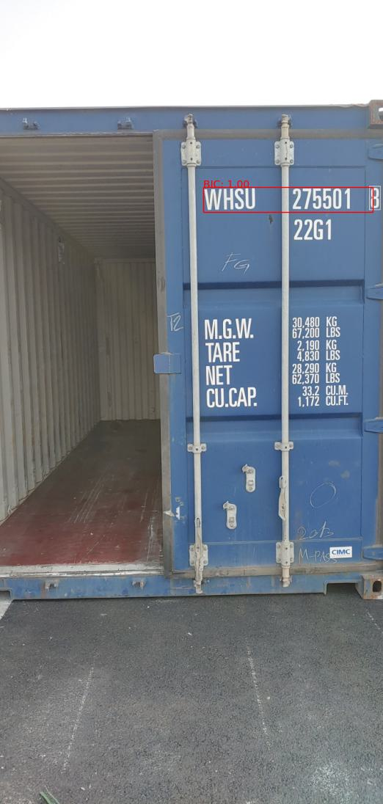
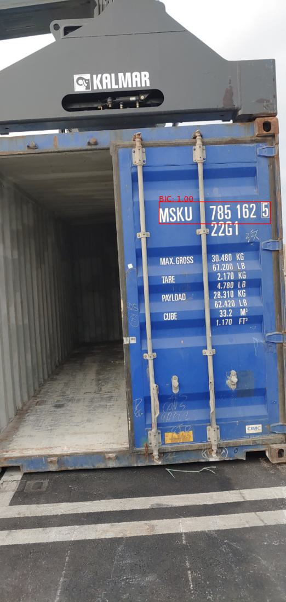

# FasterRCNN_customdataset_containerBIC
Train/Evaluation FasterRCNN Model with customdataset of container BIC code

## Dataset : Logistics Infrastructure Data for Connected Ports (AI Hub)
* URL : https://www.aihub.or.kr/aihubdata/data/view.do?currMenu=115&topMenu=100
* Train image : 131,633 / Evaluation image : 18,121

## Environment
| Hardware | Software |
| ------------ | ------------- |
| GPU : NVIDIA GeForce RTX 3060 (VRAM 12GB) | Windows 10  |
| CPU : AMD Ryzen 5600X | IDE : VSCode |
| RAM : 32GB | Python : 3.10.11 |
| SSD : 1TB | Pytorch : 1.13.1, torchvision : 0.14.1, Cuda : 11.7|

## Experiment
1. change the json files to cocodataset format to utilize pycocotools library
2. define Customdataset class
3. train (10 epoch)   * weights download : https://drive.google.com/drive/folders/1THN22Cd01a6gsQ70geVJQoaBDpR7ZRQJ?usp=drive_link
4. evaluation
5. visualization
* optimizer : SGD, learning rate: 0.005, weight decay: 0.0005, momentum: 0.9, IOU threshold: 0.5

## Result : fasterrcnn_resnet50_fpnv2 model is good
| Model | Train data | Test data | mAP | Precision | Recall | Train time (per epoch) | test time | batch size(train/test) |
| ------------ | ------------- | ------------- | ------------- | ------------- | ------------- | ------------- | ------------- | ------------- |
| fasterrcnn_mobilenet_v3_large_fpn | 131,633  | 18,121  | 0.962  | 0.990  | 0.990  | 2:27  | 0:15  | 16/16  |
| fasterrcnn_resnet50_fpn | 131,633  | 18,121  | 0.957  | 0.990  | 0.990  | 6:26  | 0:26  | 8/4  |
| fasterrcnn_resnet50_fpnv2 | 131,633 | 18,121  | 0.979  | 0.990  | 0.990  | 9:54  | 0:34  | 4/4  |

fasterrcnn_mobilenet_v3_large_fpn

fasterrcnn_resnet50_fpn

fasterrcnn_resnet50_fpnv2

## Limitation

* can't catch doubleline code
* can't catch high resolution image(above 3000pix)

## Paper : ongoing
